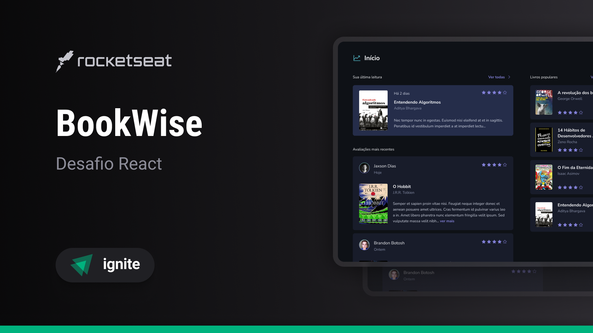

# Book Wise - Desafio React 📚

O BookWise é uma aplicação web desenvolvida com Next.js que permite aos usuários avaliar livros. A plataforma oferece uma interface intuitiva e responsiva, onde os leitores podem criar e visualizar avaliações de livros disponíveis.



[LINK DO FIGMA](https://www.figma.com/file/IwSrNBNRBGJOwbCMHKIxfa/BookWise-%E2%80%A2-Desafio-React-Copy?fuid=853790913868129834) 👨‍🎨

## Funcionalidades Principais

- **Avaliações de Livros**: Usuários podem criar e visualizar avaliações para uma ampla lista de livros pré-cadastrados.
- **Autenticação OAuth**: Login simplificado com contas do Google ou GitHub. No primeiro login, os usuários são cadastrados automaticamente no banco de dados.
- **Banco de Dados**: Utiliza MySQL hospedado no PlanetScale. O banco pode demorar alguns segundos para iniciar e pode resetar após inatividade, mantendo apenas os dados originais.
- **Renderização Server-Side (SSR)**: Implementado com Next.js para um carregamento eficiente e melhor performance.
- **Responsividade**: Design adaptado para dispositivos móveis, proporcionando uma experiência de uso consistente em diferentes telas.
- **Otimizações de SEO**: Melhorias na indexação da página pelos motores de busca.

## Tecnologias Utilizadas

- **Next.js**: Framework React para renderização server-side.
- **MySQL**: Banco de dados relacional hospedado no PlanetScale.
- **Prisma**: ORM utilizado para comunicação com o banco de dados.
- **OAuth**: Autenticação via Google e GitHub.

## Como Utilizar

1. **Instale as dependências do projeto**:
  ```bash
  npm install


2. **Configure as variáveis de ambiente**:
Copie o conteúdo abaixo para um novo arquivo .env.
Preencha as variáveis de ambiente conforme descrito abaixo.

  ```bash
  DATABASE_URL="your-database-url"
  GOOGLE_CLIENT_ID="your-google-client-id"
  GOOGLE_CLIENT_SECRET="your-google-client-secret"
  GITHUB_CLIENT_ID="your-github-client-id"
  GITHUB_CLIENT_SECRET="your-github-client-secret"
  NEXTAUTH_SECRET="your-nextauth-secret"
  ```

3. **Estabeleça a conexão com o banco de dados e execute as migrations**:
  ```bash
  npx prisma migrate dev
  ```

4. **Rode o seed do Prisma para adicionar as contas exemplo no banco de dados**:
  ```bash
  npx prisma db seed
  ```

5. **Configure as credenciais OAuth para Google e GitHub**:
Para o Google, crie um OAuth 2.0 Client ID nas credenciais da Google Cloud e preencha GOOGLE_CLIENT_ID e GOOGLE_CLIENT_SECRET.
Para o GitHub, crie um OAuth App nas configurações de desenvolvedor do GitHub e preencha GITHUB_CLIENT_ID e GITHUB_CLIENT_SECRET.
Gere um segredo para o NextAuth.js:
  ```bash
  openssl rand -base64 32
  ```

Copie o valor gerado e defina a variável NEXTAUTH_SECRET no seu arquivo .env.
Execute o projeto em ambiente de desenvolvimento:
  ```bash
  npm run dev
  ```


## 👨‍💻 Autor
Se você tiver alguma dúvida ou sugestão, sinta-se à vontade para entrar em contato!

[Gustavo Teixeira](https://github.com/taylosstls)  
[LinkedIn](https://www.linkedin.com/in/gustavoteixeiralgnt/)  
[Instagram](https://www.instagram.com/gustavo.lgnt/)

## 📄 Licença

Este projeto é licenciado sob a [Licença MIT](https://opensource.org/licenses/MIT).
